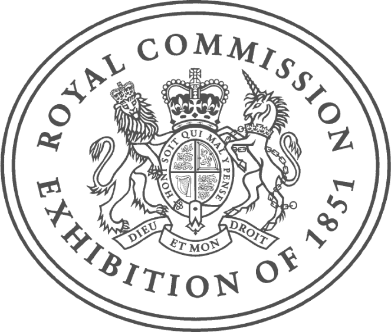
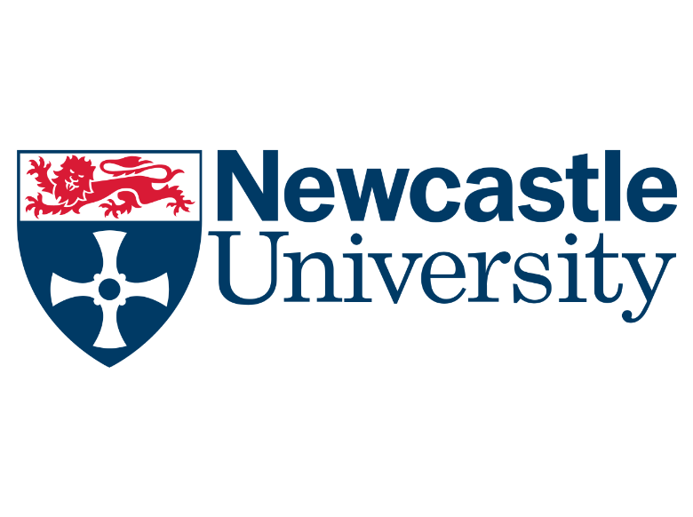

# Urban Air Mitigation Simulation

## Overview

*urban-air-mitigation-sim* is a tool designed to simulate the impact of urban-scale emission mitigation measures quantitatively. It leverages the SHERPA (Screening for High Emission Reduction Potential on Air) methodology to assess how different mitigation strategies affect air quality in urban environments.

This project integrates with the urban-air-quality-KG (https://github.com/XiangX91/urban-air-quality-kg) knowledge graph to:

* Identify potential emission reduction measures.
* Simulate their impact on air quality using SHERPA modules.
* Provide insights into the effectiveness of various mitigation strategies.

Project Documentation: [https://www.staff.ncl.ac.uk/xiangxie/github-urban-air-quality-kg-documentation/](https://www.staff.ncl.ac.uk/xiangxie/github-urban-air-mitigation-sim-documentation/)

---

## Features

- **Integration with Knowledge Graphs:** (still under development) Utilises data from urban-air-quality-KG to inform simulations.
- **Modular Design:** Employs SHERPA modules for detailed analysis.
- **Support for Multiple Pollutants:** Capable of simulating various pollutants, including PM₂.₅, NOx, and others.
- **Customisable Scenarios:**  Users can define specific mitigation measures and assess their outcomes.

---

## Installation

Prerequisites: 
* Python 3.8 or higher
* Conda for environment management

Setup:

### 1. Clone the Repository

```bash
git clone https://github.com/XiangX91/urban-air-mitigation-sim.git
cd urban-air-mitigation-sim
```

### 2. Create and activate the Conda environment

For macOS:

```bash
conda env create -f environment-Mac.yml
conda activate urban-air-mitigation-sim
```

For Windows:

```bash
conda env create -f environment-Win.yml
conda activate urban-air-mitigation-sim
```

## License
This project is licensed under the MIT License. This means you are free to use, modify, and redistribute the code, provided that you include the original copyright notice and license terms in any distributed copies or substantial portions of the software. The software is provided "as is", without warranty of any kind. 

Please note that this project integrates components from the SHERPA (Screening for High Emission Reduction Potential on Air) model, which may have its own licensing terms. Ensure you review and comply with SHERPA's license when using or distributing this project.

While not legally required, we would appreciate it if you let us know when you reuse or adapt parts of this code. Such feedback helps us understand the impact of our work and fosters collaboration.

---

## Acknowledgement 
This work was supported by the Built Environment Fellowship awarded to Dr Xiang Xie from the 1851 Royal Commission.

<table width="100%">
  <tr>
    <td align="left">
      
    </td>
    <td align="right">
      
    </td>
  </tr>
</table>


